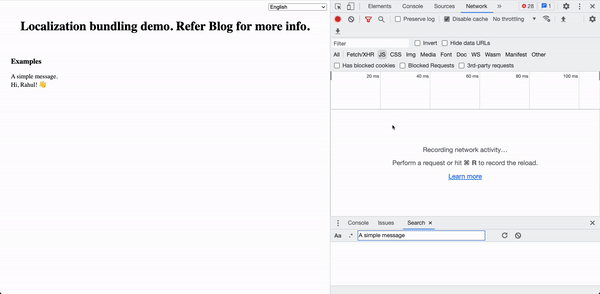

# Optimal localization demo code



This project is a tutorial on multiple ways to optimally bundle localization files.

These demos are purposely written in a simple and clear style. You will find no difficulty in following them to learn the basics.

## How to use

Locally: 
Clone the repo.

```bash
$ git clone https://github.com/rahuljain936/locale-optimize.git
```

Install the dependencies.

```bash
$ cd locale-optimize
```

Now, play with the source files under the repo's demo* directories.

```bash
$ cd demo0*-**
$ npm install
$ npm run start
```


## Index
1. [Demo01: Single Bundle](#demo01-single-bundle-source)
2. [Demo02: Dynamic Expr Import](#demo02-dynamic-expr-import-source)
3. [Demo03: Component level Dynamic Import](#demo03-component-level-dynamic-import-source)
4. [Useful links](#useful-links)

### Demo01: Single Bundle ([source](https://github.com/rahuljain936/JS-modules/tree/master/demo01-singleBundle))

```bash
$ cd demo01-singleBundle
$ npm install
$ npm run start
```


### Demo02: Dynamic Expr Import ([source](https://github.com/rahuljain936/JS-modules/tree/master/demo02-dynExprImport))

```bash
$ cd demo02-dynExprImport
$ npm install
$ npm run start
```


### Demo03: Component level Dynamic Import ([source](https://github.com/rahuljain936/JS-modules/tree/master/demo03-dynImportCompLevel))

```bash
$ cd demo03-dynImport
$ npm install
$ npm run start
```

### Useful links
- [Dynamic import](https://developer.mozilla.org/en-US/docs/Web/JavaScript/Reference/Operators/import)
- [Dynamic expressions in import](https://medium.com/r/?url=https%3A%2F%2Fwebpack.js.org%2Fapi%2Fmodule-methods%2F%23dynamic-expressions-in-import)
- [WebpackChunkName with placeholders](https://webpack.js.org/api/module-methods/#magic-comments)

### License
MIT
