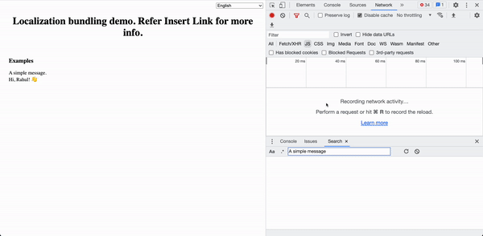

# Optimal localization demo code



This project is a tutorial on multiple ways to optimally bundle localization files.

These demos are purposely written in a simple and clear style. You will find no difficulty in following them to learn the basics.

## How to use

```bash
$ npm install
$ npm run start
```